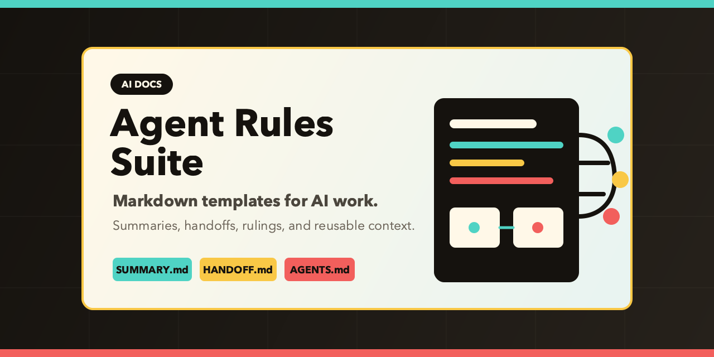

# Agent Rules Suite

A compact, GitHub-friendly home for the agent rules that keep this workspace consistent across tools, models, and repos.

## What’s inside

| File | Purpose |
| --- | --- |
| [AGENTS.md](./AGENTS.md) | Core operating rules: minimal changes, reuse first, match local style. |
| [HITL.md](./HITL.md) | Human-in-the-loop rulings and escalation boundaries. |
| [PORTMASTER.md](./PORTMASTER.md) | Port assignments, collision rules, and service notes. |
| [SUMMARY.md](./SUMMARY.md) | Quick source map for the repo. |
| [HANDOFF.md](./HANDOFF.md) | Live task state, active checklist, and continuity notes. |

## Social preview

The preview art is stored in the repo as both SVG source and PNG output so it can be reused for GitHub branding and future updates.
